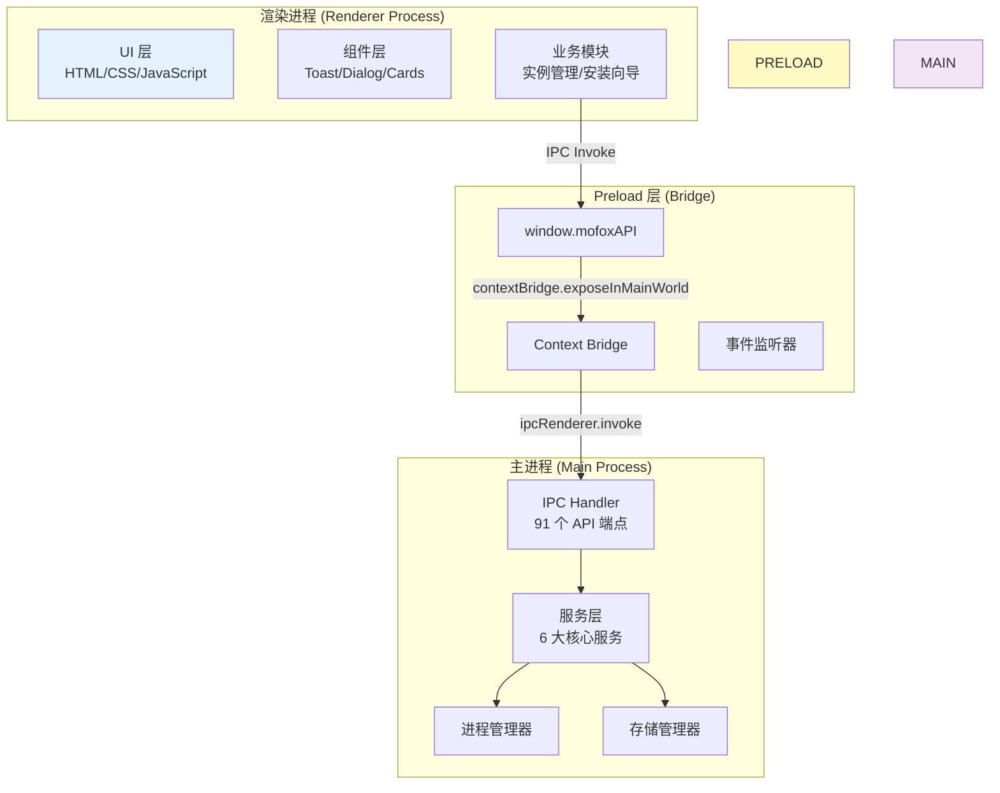
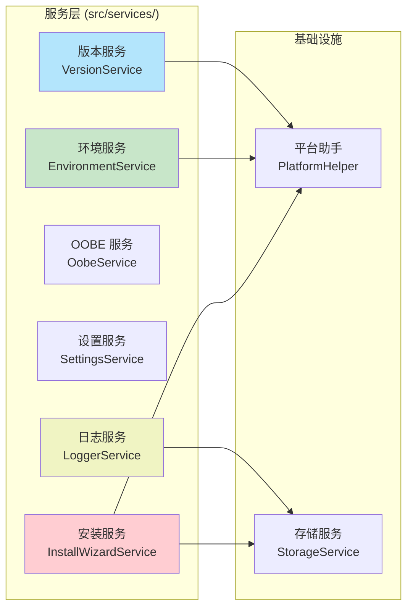
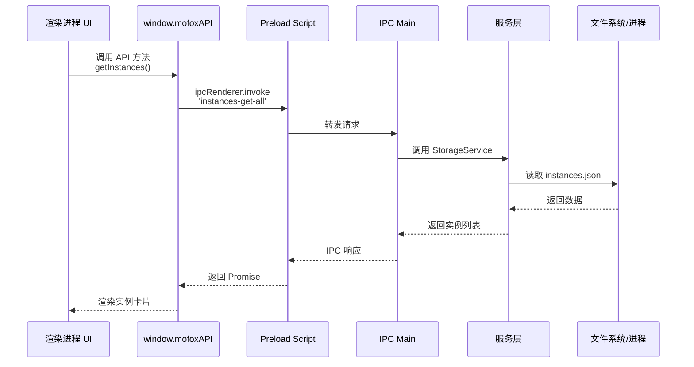
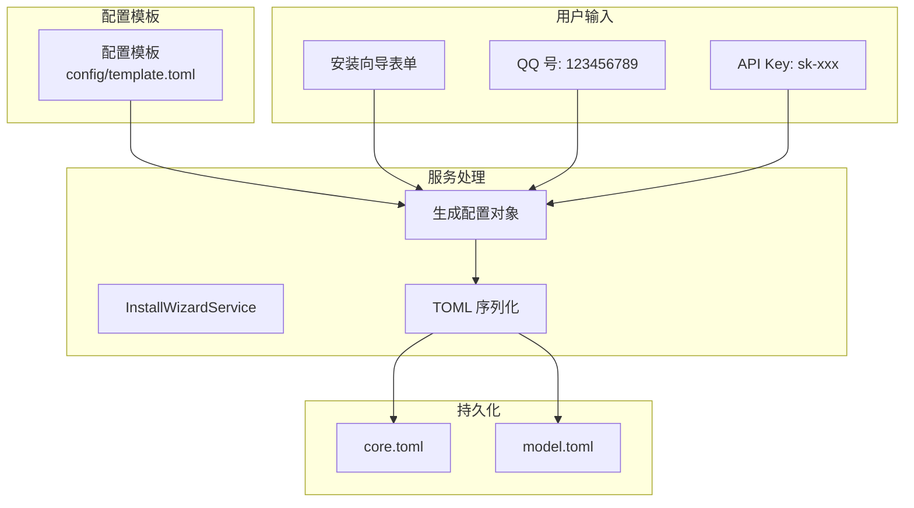

# 架构设计文档

> **文档版本**: 1.0.0  
> **最后更新**: 2026-04-02  
> **维护者**: Neo-MoFox Launcher Team

## 📖 概述

本文档详细描述 Neo-MoFox Launcher 的整体架构设计、模块划分、通信机制和技术选型决策。旨在帮助开发者快速理解系统的核心设计思想和实现原则。

**目标读者**: 核心开发者、架构设计者、新加入的贡献者

**核心设计原则**:
- **分层隔离**: 主进程/渲染进程职责清晰分离
- **服务化**: 后端功能通过独立服务类封装
- **跨平台**: 统一抽象层处理平台差异
- **安全优先**: Context Isolation + IPC 白名单机制

---

## 🏗️ 整体架构

### 1. Electron 三层架构

Neo-MoFox Launcher 基于 Electron 框架，采用经典的三层架构：



**职责划分**:

| 层级 | 职责 | 安全策略 |
|-----|------|---------|
| **渲染进程** | UI 渲染、用户交互、状态管理 | `nodeIntegration: false`<br/>`contextIsolation: true` |
| **Preload** | 暴露安全的 API、桥接 IPC 通信 | 白名单机制、只读暴露 |
| **主进程** | 业务逻辑、进程控制、文件系统操作 | 完整 Node.js 权限 |

---

### 2. 服务层架构

主进程采用 **模块化服务设计**，按功能域划分为 6 大核心服务：



#### 2.1 服务详解

**① InstallWizardService** - 安装向导服务
- **路径**: `src/services/install/InstallWizardService.js`
- **职责**:
  - 环境预检（Python ≥3.11、uv、Git）
  - 克隆 Neo-MoFox 仓库（多镜像重试）
  - 创建 Python 虚拟环境
  - 安装依赖（uv pip install）
  - 生成并写入 TOML 配置文件
  - 集成 NapCat 安装
  - WebUI 可选安装
- **关键特性**: 断点续装、进度回调、错误清理

**② EnvironmentService** - 环境检测服务
- **路径**: `src/services/environment/EnvironmentService.js`
- **职责**:
  - 检测必备工具（Python/Git/uv/VS Code）
  - 版本验证（Python ≥3.11）
  - 提供安装建议
- **关键特性**: 跨平台检测、智能路径查找

**③ OobeService** - 首次运行体验服务
- **路径**: `src/services/oobe/OobeService.js`
- **职责**:
  - OOBE 状态管理（已完成/未完成）
  - 环境向导流程控制
- **关键特性**: 持久化到 settings.json

**④ SettingsService** - 全局设置服务
- **路径**: `src/services/settings/SettingsService.js`
- **职责**:
  - 管理全局配置（主题、默认路径、日志策略）
  - 提供默认值兜底
  - 支持部分更新
- **存储格式**: JSON
- **默认配置**:
  ```javascript
  {
    defaultInstallDir: 'D:\\Neo-MoFox_Bots',
    language: 'zh-CN',
    theme: 'dark',
    autoOpenNapcatWebUI: true,
    configEditor: { useBuiltIn: true },
    logging: { maxArchiveDays: 30, compressArchive: true }
  }
  ```

**⑤ VersionService** - 版本管理服务
- **路径**: `src/services/version/VersionService.js`
- **职责**:
  - Git 分支切换（main ↔ dev）
  - Neo-MoFox 仓库更新
  - NapCat 版本下载与更新
  - 提交历史查询
- **关键特性**: 多镜像 GitHub API（官方/ghproxy/ikun114）

**⑥ LoggerService** - 日志服务
- **路径**: `src/services/LoggerService.js`
- **职责**:
  - 日志轮转（按日期/大小）
  - 归档压缩（gzip）
  - 实例日志与启动器日志分离
  - 控制台劫持
- **轮转模式**: `DATE`、`SIZE`、`BOTH`
- **默认策略**: 日志保留 30 天，自动压缩

#### 2.2 基础设施组件

**PlatformHelper** - 跨平台适配器
- **路径**: `src/services/PlatformHelper.js`
- **设计模式**: 配置表驱动
- **关键功能**:
  ```javascript
  const PLATFORM_CONFIG = {
    win32: {
      pythonCmd: 'python.exe',
      killCmd: 'taskkill',
      napcatAssetName: /windows.*x64.*exe/
    },
    linux: {
      pythonCmd: 'python3',
      killCmd: 'kill',
      napcatAssetName: null  // 需手动安装
    },
    darwin: {
      pythonCmd: 'python3',
      killCmd: 'kill',
      napcatAssetName: null
    }
  };
  ```

**StorageService** - 存储抽象层
- **路径**: `src/services/install/StorageService.js`
- **职责**: instances.json/settings.json 管理、TOML 读写
- **特性**: 原子写入（.tmp 临时文件）、版本迁移
- **详细设计**: 参见 `07-storage.md`

---

### 3. IPC 通信架构

#### 3.1 通信流程



#### 3.2 IPC API 分类

主进程共注册 **91 个 IPC Handler**，按功能分为 8 大类：

| 分类 | 数量 | 典型 API | 说明 |
|-----|------|---------|-----|
| **实例管理** | 15 | `instances-get-all`<br/>`instances-add`<br/>`instances-update` | 实例 CRUD 操作 |
| **进程控制** | 12 | `instance-start`<br/>`instance-stop`<br/>`instance-restart` | 进程生命周期管理 |
| **日志操作** | 8 | `instance-get-logs`<br/>`instance-clear-logs`<br/>`instance-export-logs` | 日志查询与管理 |
| **配置编辑** | 10 | `config-editor:open`<br/>`config-editor:read`<br/>`config-editor:write` | TOML 配置编辑 |
| **版本管理** | 9 | `version-switch-branch`<br/>`version-update-napcat` | Git 分支/NapCat 更新 |
| **环境检测** | 12 | `env-check-python`<br/>`env-check-git` | 工具检测与安装 |
| **设置管理** | 7 | `settings-get`<br/>`settings-set` | 全局设置读写 |
| **其他** | 18 | `select-directory`<br/>`open-external` | 对话框、外部链接等 |

**完整 API 列表**: 参见 `docs/API-REFERENCE.md`

#### 3.3 安全机制

**Context Isolation**:
```javascript
// main.js - 窗口创建配置
const mainWindow = new BrowserWindow({
  webPreferences: {
    preload: path.join(__dirname, 'preload.js'),
    contextIsolation: true,      // ✅ 启用上下文隔离
    nodeIntegration: false,       // ✅ 禁用 Node 集成
    sandbox: false                // 需要访问某些 Node API
  }
});
```

**API 白名单**:
```javascript
// preload.js - 仅暴露安全的 API
contextBridge.exposeInMainWorld('mofoxAPI', {
  // 实例管理
  getInstances: () => ipcRenderer.invoke('instances-get-all'),
  addInstance: (data) => ipcRenderer.invoke('instances-add', data),
  
  // 进程控制
  startInstance: (id) => ipcRenderer.invoke('instance-start', id),
  stopInstance: (id) => ipcRenderer.invoke('instance-stop', id),
  
  // 事件监听（仅接收，不发送）
  onInstallProgress: (callback) => {
    ipcRenderer.on('install-progress', (_, data) => callback(data));
  }
});
```

**⚠️ 安全隐患**:
- 配置编辑器窗口使用 `contextIsolation: false`（需改进）
- 建议迁移到安全 IPC 模式

---

### 4. 数据流架构

#### 4.1 核心数据流

```mermaid
graph LR
    subgraph "用户操作"
        USER[用户点击<br/>"启动实例"]
    end
    
    subgraph "渲染进程"
        UI[实例详情页]
        STATE[状态管理<br/>isRunning = true]
    end
    
    subgraph "IPC 通道"
        INVOKE[instance-start]
    end
    
    subgraph "主进程"
        HANDLER[IPC Handler]
        PROCESS_MGR[进程管理器]
        SPAWN[spawn Python]
    end
    
    subgraph "系统进程"
        PYTHON[Neo-MoFox 进程]
        LOG[stdout/stderr]
    end
    
    USER --> UI
    UI -->|调用 API| INVOKE
    INVOKE --> HANDLER
    HANDLER --> PROCESS_MGR
    PROCESS_MGR -->|child_process.spawn| SPAWN
    SPAWN --> PYTHON
    PYTHON --> LOG
    LOG -->|IPC 推送| UI
    UI --> STATE
```

#### 4.2 配置数据流



---

## 📂 目录结构详解

### 实际项目结构

```
Neo-MoFox-Launcher/
├── src/
│   ├── main.js                      # 主进程入口（~2400行）
│   │   ├── 窗口创建逻辑
│   │   ├── 91 个 IPC Handler 注册
│   │   ├── 进程管理（instanceProcesses Map）
│   │   └── 应用生命周期管理
│   │
│   ├── preload.js                   # Preload 脚本（~300行）
│   │   ├── contextBridge.exposeInMainWorld
│   │   ├── 91 个 API 方法暴露
│   │   └── 事件监听器注册
│   │
│   ├── services/                    # 后端服务层
│   │   ├── install/
│   │   │   ├── InstallWizardService.js    # 安装向导核心逻辑
│   │   │   └── StorageService.js          # 数据持久化
│   │   ├── environment/
│   │   │   ├── EnvironmentService.js      # 环境检测
│   │   │   └── RecommendedTools.js        # 推荐工具列表
│   │   ├── oobe/
│   │   │   └── OobeService.js             # 首次运行体验
│   │   ├── settings/
│   │   │   └── SettingsService.js         # 全局设置
│   │   ├── version/
│   │   │   └── VersionService.js          # 版本管理
│   │   ├── LoggerService.js               # 日志系统
│   │   └── PlatformHelper.js              # 跨平台适配
│   │
│   ├── renderer/                    # 渲染进程（前端）
│   │   ├── index.html               # 应用入口
│   │   ├── renderer.js              # 路由重定向
│   │   │
│   │   ├── main-view/               # 主界面
│   │   │   ├── index.html           # 实例卡片列表
│   │   │   ├── styles.css           # Material Design 3 样式
│   │   │   └── modules/
│   │   │       └── instances.js     # 实例管理模块
│   │   │
│   │   ├── install-wizard/          # 安装向导
│   │   │   ├── wizard.html
│   │   │   ├── wizard.css
│   │   │   └── wizard.js            # 10 步流程控制
│   │   │
│   │   ├── instance-view/           # 实例详情页
│   │   │   ├── index.html
│   │   │   ├── instance.css
│   │   │   └── instance.js          # 日志查看、进程控制
│   │   │
│   │   ├── environment-view/        # 环境检测页面
│   │   │   └── environment.html
│   │   │
│   │   ├── settings-view/           # 设置页面
│   │   │   └── settings.html
│   │   │
│   │   ├── version-view/            # 版本管理页面
│   │   │   └── version.html
│   │   │
│   │   └── components/              # 通用组件
│   │       ├── toast.js             # Toast 通知
│   │       └── dialog.css           # 对话框样式
│   │
│   └── windows/                     # 独立窗口
│       └── editor/                  # 配置编辑器
│           ├── editor.html
│           ├── editor.js            # CodeMirror 6 集成
│           ├── toml-linter.js       # TOML Lint 插件
│           └── theme.js             # 主题系统
│
├── assets/                          # 资源文件
│   └── icon.png                     # 应用图标
│
├── scripts/                         # 辅助脚本
│   └── collect-toml-errors.js       # TOML 错误收集工具
│
├── docs/                            # 文档目录
│   ├── toml-error-translation-guide.md
│   └── (待补充的文档)
│
├── launcher-design/                 # 设计文档（本目录）
│   ├── 01-architecture.md           # 架构设计（本文档）
│   ├── 02-install-wizard.md         # （待创建）
│   └── ...
│
├── electron-builder.yml             # 打包配置
├── package.json                     # 项目配置
└── README.md                        # 用户文档
```

### 与 README.md 对比

**README 中描述的结构**（规划）:
```
Neo-MoFox-Launcher/
└── Neo-MoFox-Launcher/
    └── src/
        ├── services/
        │   ├── install/      # ✅ 已实现
        │   ├── instance/     # ❌ 未实现（逻辑在 main.js）
        │   ├── process/      # ❌ 未实现（逻辑在 main.js）
        │   └── update/       # ✅ 已实现（VersionService）
        └── renderer/
            └── (基本一致)
```

**实际差异**:
- `instance/` 和 `process/` 服务未独立抽离，逻辑在 `main.js` 中
- 增加了 `environment/`、`oobe/`、`settings/` 服务
- 增加了 `windows/editor/` 独立窗口

---

## 🔧 技术栈详解

### 核心框架

**Electron 33.0.0**
- **选择理由**:
  - 跨平台桌面应用标准方案
  - 成熟的生态系统（electron-builder）
  - 支持 Node.js + Chromium 双引擎
- **版本决策**: 使用稳定的最新版本，支持最新 Web API

**Node.js 18+ (LTS)**
- **选择理由**:
  - 长期支持版本，稳定性保障
  - 原生 Fetch API 支持
  - 性能优化（V8 引擎升级）

### 核心依赖库

| 依赖 | 版本 | 用途 | 选择理由 |
|------|------|------|---------|
| `@iarna/toml` | ^2.2.5 | TOML 配置文件读写 | 完整支持 TOML 1.0 规范、错误信息友好 |
| `tree-kill` | ^1.2.2 | 进程树终止 | 跨平台杀死子进程及其所有子进程 |
| `archiver` | ^5.3.1 | 日志归档压缩 | 支持 gzip 压缩、流式处理 |
| `systeminformation` | ^5.17.12 | 系统资源监控 | CPU/内存使用率监控 |

### 前端技术栈

**原生 Web 技术**（无框架）
- **HTML5 + CSS3 + Vanilla JavaScript**
- **选择理由**:
  - 轻量级，启动速度快
  - 无构建工具依赖（直接运行）
  - 学习曲线低
- **权衡**: 牺牲了 React/Vue 的组件化开发体验

**Material Design 3**
- **设计系统**: Google Material Design 3
- **实现方式**: 自定义 CSS Variables + Material Symbols 图标字体
- **特性**:
  - 深色/浅色主题切换
  - 动态色彩系统
  - 流畅动画过渡

**CodeMirror 6**
- **用途**: TOML 配置编辑器
- **选择理由**:
  - 现代化架构（基于状态机）
  - 强大的扩展系统
  - 性能优异（虚拟滚动）
- **集成**: 自定义 TOML Linter + 主题系统

### 构建工具

**electron-builder**
- **用途**: 应用打包与分发
- **配置**: `electron-builder.yml`
- **支持平台**:
  - Windows: NSIS 安装器 + 便携版
  - Linux: AppImage + deb
  - macOS: DMG（规划中）

---

## 🔀 关键设计决策

### 决策 1: 为何不使用前端框架？

**背景**: 许多 Electron 应用使用 React/Vue/Angular

**决策**: 采用原生 JavaScript

**理由**:
1. **性能优先**: 无需 Virtual DOM，直接操作 DOM，启动速度快
2. **简化构建**: 无需 Webpack/Vite，减少依赖和构建时间
3. **团队技能**: 降低学习曲线，HTML/CSS/JS 是基础技能
4. **应用规模**: Launcher 复杂度不高，不需要重量级框架

**权衡**:
- ❌ 组件复用性降低
- ❌ 状态管理需手动实现
- ✅ 启动时间 < 3 秒
- ✅ 打包体积更小

---

### 决策 2: 进程管理为何在 main.js 而非独立服务？

**背景**: README 规划中有 `process/` 服务目录

**决策**: 进程管理逻辑保留在 `main.js`

**理由**:
1. **生命周期绑定**: 进程需要与主进程生命周期强绑定
2. **状态共享**: `instanceProcesses Map` 需要被多个 IPC Handler 访问
3. **性能考虑**: 避免额外的服务层调用开销

**未来优化**:
- 可抽离为 `ProcessManager` 类（保留在 main.js）
- 使用 EventEmitter 解耦状态变更通知

---

### 决策 3: 为何使用 JSON 而非 SQLite 存储？

**背景**: 实例数据量较小（通常 < 50 个实例）

**决策**: 使用 `instances.json` 存储实例列表

**理由**:
1. **简单性**: JSON 读写无需额外依赖
2. **可读性**: 用户可直接查看/编辑配置
3. **备份方便**: 单文件复制即可备份
4. **性能足够**: 数据量小，内存加载无压力

**迁移路径**:
- 如实例数量 > 100，考虑迁移到 SQLite
- 提供数据迁移工具

---

### 决策 4: 配置编辑器为何使用独立窗口？

**背景**: 配置编辑需要 CodeMirror 6 大量依赖

**决策**: 编辑器在独立窗口中运行

**理由**:
1. **性能隔离**: 编辑器不影响主窗口性能
2. **按需加载**: 仅在需要时加载 CodeMirror 依赖
3. **焦点管理**: 独立窗口便于全屏编辑

**安全问题**:
- ⚠️ 当前使用 `contextIsolation: false`（为了简化 CodeMirror 集成）
- **改进方向**: 迁移到安全 IPC 模式，通过主进程读写文件

---

## 🔗 相关文档

### 设计文档（本系列）
- [02-install-wizard.md](./02-install-wizard.md) - 安装向导设计
- [03-napcat-installer.md](./03-napcat-installer.md) - NapCat 安装器
- [04-instance-manager.md](./04-instance-manager.md) - 实例管理器
- [05-process-manager.md](./05-process-manager.md) - 进程管理器
- [06-update-channel.md](./06-update-channel.md) - 更新通道
- [07-storage.md](./07-storage.md) - 数据持久化
- [08-ui-design.md](./08-ui-design.md) - UI 设计规范

### 开发文档
- [../docs/API-REFERENCE.md](../docs/API-REFERENCE.md) - IPC API 详细参考
- [../DEVELOPMENT.md](../DEVELOPMENT.md) - 开发者指南
- [../docs/CONFIG-EDITOR-GUIDE.md](../docs/CONFIG-EDITOR-GUIDE.md) - 配置编辑器开发指南

### 用户文档
- [../README.md](../README.md) - 项目主文档

---

## 📚 参考资源

### Electron 官方文档
- [进程模型](https://www.electronjs.org/docs/latest/tutorial/process-model)
- [Context Isolation](https://www.electronjs.org/docs/latest/tutorial/context-isolation)
- [IPC 通信](https://www.electronjs.org/docs/latest/tutorial/ipc)

### 代码文件
- [src/main.js](../src/main.js) - 主进程入口（2400 行）
- [src/preload.js](../src/preload.js) - Preload 脚本
- [src/services/](../src/services/) - 服务层实现
- [electron-builder.yml](../electron-builder.yml) - 打包配置

### 外部资源
- [Material Design 3](https://m3.material.io/)
- [CodeMirror 6 文档](https://codemirror.net/docs/)
- [TOML 规范](https://toml.io/en/v1.0.0)

---

## 📝 更新日志

| 版本 | 日期 | 变更内容 |
|------|------|---------|
| 1.0.0 | 2026-04-02 | 初版发布，完整架构设计文档 |

---

*如有问题或建议，请在 [GitHub Issues](https://github.com/MoFox-Studio/Neo-MoFox-Launcher/issues) 提出*
