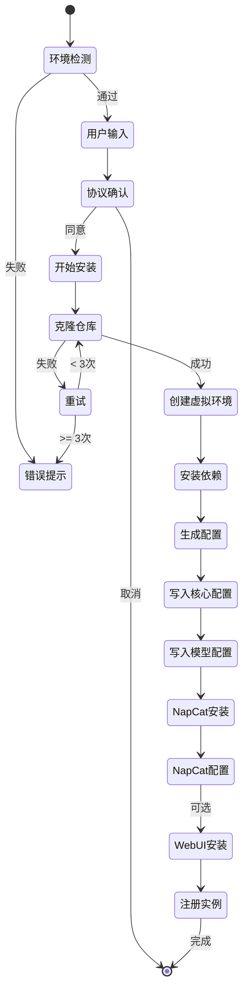
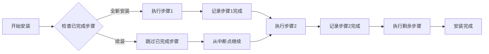
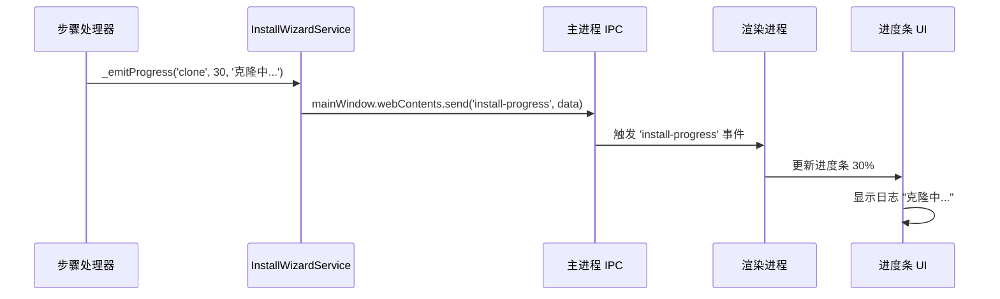

# 安装向导设计

> **文档版本**: 1.0.0  
> **最后更新**: 2026-04-02  
> **维护者**: Neo-MoFox Launcher Team

## 📖 概述

本文档详细描述 Neo-MoFox Launcher 的安装向导系统设计，包括安装流程、步骤编排、断点续装、进度回调和错误处理机制。

**目标读者**: 核心开发者、安装流程维护者

**核心设计原则**:
- **用户友好**: 10 步可视化流程，实时进度反馈
- **健壮性**: 支持断点续装，失败不影响已完成步骤
- **多镜像**: 自动切换国内镜像，提升成功率
- **可追溯**: 完整日志记录，便于问题排查

---

## 🗺️ 安装流程概览

### 流程状态机



### 10 步安装步骤

| 步骤 | 步骤名 | 预计耗时 | 主要操作 | 可回滚性 |
|------|--------|---------|---------|---------|
| 1 | `clone` | 30-120s | 克隆 Neo-MoFox 仓库 | ✅ 可删除目录 |
| 2 | `venv` | 10-30s | 创建 Python 虚拟环境 | ✅ 可删除 .venv |
| 3 | `deps` | 60-180s | 安装 Python 依赖 | ⚠️ 需重新安装 |
| 4 | `gen-config` | <1s | 生成配置模板 | ✅ 可重新生成 |
| 5 | `write-core` | <1s | 写入 core.toml | ✅ 可覆盖 |
| 6 | `write-model` | <1s | 写入 model.toml | ✅ 可覆盖 |
| 7 | `write-adapter` | <1s | 配置 NapCat Adapter | ✅ 可覆盖 |
| 8 | `napcat` | 20-60s | 下载 NapCat | ✅ 可重新下载 |
| 9 | `napcat-config` | <1s | 配置 NapCat | ✅ 可覆盖 |
| 10 | `webui` | 60-180s | 安装 WebUI（可选） | ✅ 可选步骤 |
| 11 | `register` | <1s | 注册实例到列表 | ✅ 可删除 |

**总预计时间**: 3-10 分钟（取决于网络速度）

---

## 🏗️ 安装向导架构

### 核心组件

```mermaid
graph TB
    subgraph "UI 层 (renderer/install-wizard/)"
        FORM[表单组件<br/>wizard.html]
        PROGRESS[进度显示<br/>进度条+日志]
        VALIDATION[输入验证<br/>QQ号/端口/API Key]
    end
    
    subgraph "Preload 层"
        API[window.mofoxAPI<br/>startInstall()]
        EVENTS[事件监听<br/>onInstallProgress]
    end
    
    subgraph "主进程 - InstallWizardService"
        ORCHESTRATOR[流程编排器<br/>_install()]
        STEP_HANDLERS[步骤处理器<br/>_cloneRepo()<br/>_createVenv()<br/>...]
        PROGRESS_CB[进度回调<br/>_emitProgress()]
    end
    
    subgraph "依赖服务"
        STORAGE[StorageService<br/>注册实例]
        PLATFORM[PlatformHelper<br/>跨平台适配]
        LOGGER[LoggerService<br/>日志记录]
    end
    
    FORM -->|提交| API
    API -->|IPC| ORCHESTRATOR
    ORCHESTRATOR --> STEP_HANDLERS
    STEP_HANDLERS --> PROGRESS_CB
    PROGRESS_CB -->|IPC| EVENTS
    EVENTS --> PROGRESS
    
    ORCHESTRATOR --> STORAGE
    STEP_HANDLERS --> PLATFORM
    STEP_HANDLERS --> LOGGER
```

---

## 📋 步骤详解

### 步骤 1: 克隆仓库 (`clone`)

**目标**: 从 GitHub 克隆 Neo-MoFox 仓库到本地

**实现代码**:

```javascript
async _cloneRepo(instanceId, neomofoxDir, _config) {
  const MIRRORS = [
    'https://github.com/MoFox-Studio/Neo-MoFox.git',
    'https://ghproxy.net/https://github.com/MoFox-Studio/Neo-MoFox.git',
    'https://mirror.ghproxy.com/https://github.com/MoFox-Studio/Neo-MoFox.git'
  ];
  
  let lastError;
  for (const gitUrl of MIRRORS) {
    try {
      this._emitProgress(instanceId, 'clone', 10, `正在克隆仓库（镜像: ${gitUrl}）...`);
      
      await this._execCommand('git', [
        'clone',
        '--depth', '1',  // 浅克隆，仅最新提交
        '--single-branch',
        '--branch', _config.channel || 'main',
        gitUrl,
        neomofoxDir
      ]);
      
      this._emitProgress(instanceId, 'clone', 100, '仓库克隆完成');
      return;
    } catch (error) {
      lastError = error;
      logger.warn(`镜像 ${gitUrl} 克隆失败，尝试下一个...`);
    }
  }
  
  throw new Error(`所有镜像克隆失败: ${lastError.message}`);
}
```

**关键特性**:
- ✅ **多镜像重试**: 依次尝试 GitHub 官方 → ghproxy.net → mirror.ghproxy.com
- ✅ **浅克隆**: `--depth 1` 仅下载最新提交，减少下载量
- ✅ **分支指定**: 支持 `main` / `dev` 分支

**失败场景**:
- 网络连接失败
- Git 未安装
- 磁盘空间不足
- 目标目录已存在

---

### 步骤 2-3: Python 环境 (`venv` + `deps`)

**步骤 2: 创建虚拟环境**

```javascript
async _createVenv(instanceId, neomofoxDir) {
  const pythonCmd = platformHelper.getPythonCommand();
  const venvPath = path.join(neomofoxDir, '.venv');
  
  this._emitProgress(instanceId, 'venv', 20, '正在创建 Python 虚拟环境...');
  
  await this._execCommand(pythonCmd, ['-m', 'venv', venvPath], {
    cwd: neomofoxDir
  });
  
  this._emitProgress(instanceId, 'venv', 100, '虚拟环境创建完成');
}
```

**步骤 3: 安装依赖**

```javascript
async _installDeps(instanceId, neomofoxDir) {
  const uvCmd = platformHelper.getUvCommand();
  
  this._emitProgress(instanceId, 'deps', 30, '正在安装 Python 依赖（这可能需要几分钟）...');
  
  // 使用清华镜像加速
  const env = {
    ...process.env,
    UV_INDEX_URL: 'https://pypi.tuna.tsinghua.edu.cn/simple'
  };
  
  await this._execCommand(uvCmd, ['pip', 'install', '-r', 'requirements.txt'], {
    cwd: neomofoxDir,
    env
  });
  
  this._emitProgress(instanceId, 'deps', 100, '依赖安装完成');
}
```

**关键特性**:
- ✅ 使用 `uv` 加速安装（比 pip 快 10-100 倍）
- ✅ 配置清华镜像源
- ✅ 虚拟环境隔离，不污染全局

---

### 步骤 4-7: 配置生成与写入

**步骤 4: 生成配置模板**

```javascript
async _generateConfig(instanceId, _userConfig) {
  this._emitProgress(instanceId, 'gen-config', 50, '正在生成配置模板...');
  
  const coreConfig = {
    bot: {
      platform: 'qq',
      qq_number: _userConfig.qqNumber
    },
    database: {
      database_type: 'sqlite'
    },
    general: {
      master_users: [parseInt(_userConfig.qqNumber)]
    },
    adapter: {
      adapter_config: {
        websocket_url: `ws://localhost:${_userConfig.wsPort}`,
        reverse_websocket: {
          enabled: true,
          port: parseInt(_userConfig.wsPort)
        }
      }
    },
    webui: {
      enabled: _userConfig.installWebUI,
      webui_api_key: _userConfig.webuiToken
    }
  };
  
  const modelConfig = {
    model_sets: {
      default: {
        model: 'gpt-4o-mini',
        api_key: _userConfig.apiKey,
        base_url: _userConfig.apiBaseUrl
      }
    }
  };
  
  this._emitProgress(instanceId, 'gen-config', 100, '配置模板生成完成');
  return { coreConfig, modelConfig };
}
```

**步骤 5-6: 写入 TOML 文件**

```javascript
async _writeCoreConfig(instanceId, neomofoxDir, coreConfig) {
  const configDir = path.join(neomofoxDir, 'config');
  await fs.mkdir(configDir, { recursive: true });
  
  const coreTomlPath = path.join(configDir, 'core.toml');
  const tomlString = TOML.stringify(coreConfig);
  
  this._emitProgress(instanceId, 'write-core', 50, '正在写入核心配置...');
  await fs.writeFile(coreTomlPath, tomlString, 'utf8');
  this._emitProgress(instanceId, 'write-core', 100, 'core.toml 写入完成');
}

async _writeModelConfig(instanceId, neomofoxDir, modelConfig) {
  const modelTomlPath = path.join(neomofoxDir, 'config', 'model.toml');
  const tomlString = TOML.stringify(modelConfig);
  
  this._emitProgress(instanceId, 'write-model', 50, '正在写入模型配置...');
  await fs.writeFile(modelTomlPath, tomlString, 'utf8');
  this._emitProgress(instanceId, 'write-model', 100, 'model.toml 写入完成');
}
```

**步骤 7: 配置 Adapter**

```javascript
async _writeAdapterConfig(instanceId, neomofoxDir, qqNumber, wsPort) {
  const adapterConfigPath = path.join(
    neomofoxDir,
    'config',
    'plugins',
    'napcat_adapter.toml'
  );
  
  const adapterConfig = {
    qq_number: qqNumber,
    websocket_port: parseInt(wsPort)
  };
  
  await fs.mkdir(path.dirname(adapterConfigPath), { recursive: true });
  await fs.writeFile(adapterConfigPath, TOML.stringify(adapterConfig), 'utf8');
  
  this._emitProgress(instanceId, 'write-adapter', 100, 'Adapter 配置完成');
}
```

---

### 步骤 8-9: NapCat 集成

**步骤 8: 下载 NapCat**

```javascript
async _installNapCat(instanceId, napcatDir) {
  const platform = process.platform;
  
  if (platform !== 'win32') {
    this._emitProgress(instanceId, 'napcat', 0, 
      '当前平台不支持自动安装 NapCat，请手动安装', 
      { warn: true }
    );
    return;
  }
  
  this._emitProgress(instanceId, 'napcat', 10, '正在获取 NapCat 最新版本...');
  
  const releaseInfo = await this._fetchLatestNapCatRelease();
  const assetUrl = releaseInfo.assets.find(a => 
    /windows.*x64.*exe/i.test(a.name)
  ).browser_download_url;
  
  this._emitProgress(instanceId, 'napcat', 30, '正在下载 NapCat...');
  
  await this._downloadFile(assetUrl, napcatDir, (progress) => {
    this._emitProgress(instanceId, 'napcat', 30 + (progress * 0.6), 
      `下载中... ${progress}%`
    );
  });
  
  this._emitProgress(instanceId, 'napcat', 100, 'NapCat 下载完成');
}
```

**步骤 9: 配置 NapCat**

```javascript
async _configureNapCat(instanceId, napcatDir, qqNumber, wsPort) {
  const configPath = path.join(
    napcatDir,
    'config',
    `onebot11_${qqNumber}.json`
  );
  
  const napcatConfig = {
    http: { enable: false },
    ws: { enable: false },
    reverseWs: {
      enable: true,
      urls: [`ws://localhost:${wsPort}`]
    }
  };
  
  await fs.mkdir(path.dirname(configPath), { recursive: true });
  await fs.writeFile(configPath, JSON.stringify(napcatConfig, null, 2), 'utf8');
  
  // 生成启动脚本
  const batContent = `@echo off
cd /d "%~dp0"
NapCat.win32.x64.exe -q ${qqNumber}
pause`;
  
  await fs.writeFile(path.join(napcatDir, 'napcat.bat'), batContent, 'utf8');
  
  this._emitProgress(instanceId, 'napcat-config', 100, 'NapCat 配置完成');
}
```

---

### 步骤 10: WebUI 安装（可选）

```javascript
async _installWebUI(instanceId, neomofoxDir) {
  const webuiDir = path.join(path.dirname(neomofoxDir), 'webui');
  
  this._emitProgress(instanceId, 'webui', 10, '正在克隆 WebUI 仓库...');
  
  await this._execCommand('git', [
    'clone',
    '--depth', '1',
    'https://github.com/MoFox-Studio/MoFox-Core-Webui.git',
    webuiDir
  ]);
  
  this._emitProgress(instanceId, 'webui', 40, '正在安装 WebUI 依赖...');
  
  await this._execCommand('pnpm', ['install'], {
    cwd: webuiDir,
    timeout: 300000  // 5 分钟超时
  });
  
  this._emitProgress(instanceId, 'webui', 100, 'WebUI 安装完成');
}
```

---

### 步骤 11: 注册实例

```javascript
async _registerInstance(instanceId, installConfig) {
  const instanceData = {
    id: instanceId,
    displayName: installConfig.displayName,
    qqNumber: installConfig.qqNumber,
    neomofoxDir: installConfig.neomofoxDir,
    napcatDir: installConfig.napcatDir,
    installCompleted: true,
    installSteps: this.completedSteps,
    channel: installConfig.channel,
    createdAt: new Date().toISOString()
  };
  
  await storageService.addInstance(instanceData);
  
  this._emitProgress(instanceId, 'register', 100, '实例注册完成');
}
```

---

## 🔄 断点续装机制

### 设计原理

**核心思想**: 每完成一个步骤，立即记录到 `installSteps` 数组

**数据流**:



### 实现代码

```javascript
class InstallWizardService {
  async startInstall(config) {
    const instance = await storageService.getInstanceById(config.instanceId);
    this.completedSteps = instance?.installSteps || [];
    
    const ALL_STEPS = [
      'clone', 'venv', 'deps', 'gen-config',
      'write-core', 'write-model', 'write-adapter',
      'napcat', 'napcat-config', 'webui', 'register'
    ];
    
    for (const step of ALL_STEPS) {
      // 跳过已完成步骤
      if (this.completedSteps.includes(step)) {
        logger.info(`跳过已完成步骤: ${step}`);
        continue;
      }
      
      try {
        // 执行步骤
        await this._executeStep(step, config);
        
        // 立即记录完成状态
        this.completedSteps.push(step);
        await storageService.updateInstance(config.instanceId, {
          installSteps: this.completedSteps
        });
        
        logger.info(`步骤 ${step} 完成`);
      } catch (error) {
        logger.error(`步骤 ${step} 失败:`, error);
        throw error;  // 中断安装
      }
    }
  }
}
```

### 续装场景示例

**场景 1: 网络中断重试**

```
初次安装:
  ✅ clone
  ✅ venv
  ❌ deps (网络中断)

续装时:
  ⏭️ 跳过 clone
  ⏭️ 跳过 venv
  ▶️ 重新执行 deps  <-- 从这里继续
```

**场景 2: 用户主动取消**

```
初次安装:
  ✅ clone
  ✅ venv
  ✅ deps
  ✅ gen-config
  ❌ 用户点击"取消"

续装时:
  ⏭️ 跳过前 4 步
  ▶️ 从 write-core 继续
```

---

## 📊 进度回调系统

### 回调机制



### 回调接口定义

```typescript
interface InstallProgressData {
  instanceId: string;      // 实例 ID
  step: string;            // 当前步骤名 (如 'clone')
  percent: number;         // 步骤内进度 (0-100)
  message: string;         // 进度消息
  error?: string;          // 错误信息（可选）
  warn?: boolean;          // 是否为警告（可选）
}
```

### 实现代码

```javascript
// InstallWizardService.js
_emitProgress(instanceId, step, percent, message, options = {}) {
  const data = {
    instanceId,
    step,
    percent,
    message,
    ...options
  };
  
  // 发送到渲染进程
  const mainWindow = BrowserWindow.getFocusedWindow();
  mainWindow?.webContents.send('install-progress', data);
  
  // 同时记录日志
  logger.info(`[${instanceId}] ${step}: ${percent}% - ${message}`);
}

// wizard.js (渲染进程)
window.mofoxAPI.onInstallProgress((data) => {
  const { step, percent, message, error } = data;
  
  // 更新进度条
  const progressBar = document.getElementById('progress-bar');
  progressBar.style.width = `${percent}%`;
  
  // 追加日志
  const logContainer = document.getElementById('install-log');
  const logEntry = document.createElement('div');
  logEntry.className = error ? 'log-error' : 'log-info';
  logEntry.textContent = `[${step}] ${message}`;
  logContainer.appendChild(logEntry);
  
  // 自动滚动到底部
  logContainer.scrollTop = logContainer.scrollHeight;
});
```

---

## ❌ 错误处理

### 错误分类

| 错误类型 | 严重度 | 处理策略 | 示例 |
|---------|--------|---------|------|
| **网络错误** | 🟡 中 | 多镜像重试 | Git 克隆失败 |
| **环境错误** | 🔴 高 | 中止安装，提示用户 | Python 版本不符 |
| **磁盘错误** | 🔴 高 | 中止安装，提示用户 | 磁盘空间不足 |
| **配置错误** | 🟡 中 | 可忽略或重新生成 | TOML 写入失败 |
| **可选步骤失败** | 🟢 低 | 记录警告，继续 | WebUI 安装失败 |

### 清理机制

**失败时清理资源**:

```javascript
async installCleanup(instanceId) {
  try {
    const instance = await storageService.getInstanceById(instanceId);
    if (!instance) return;
    
    const { neomofoxDir, napcatDir } = instance;
    
    // 删除实例目录
    await fs.rm(path.dirname(neomofoxDir), { recursive: true, force: true });
    
    // 从实例列表移除
    await storageService.deleteInstance(instanceId);
    
    logger.info(`实例 ${instanceId} 清理完成`);
  } catch (error) {
    logger.error('清理失败:', error);
  }
}
```

**UI 调用**:

```javascript
// wizard.js - 安装失败后
if (installFailed) {
  const shouldCleanup = await window.customConfirm(
    '安装失败，是否清理已下载的文件？',
    '清理确认'
  );
  
  if (shouldCleanup) {
    await window.mofoxAPI.installCleanup(instanceId);
  }
}
```

---

## 🎯 UI 流程详解

### 10 步向导页面

```html
<!-- wizard.html - 步骤指示器 -->
<div class="wizard-steps">
  <div class="step active" data-step="1">
    <span class="step-number">1</span>
    <span class="step-label">环境检测</span>
  </div>
  <div class="step" data-step="2">
    <span class="step-number">2</span>
    <span class="step-label">基本信息</span>
  </div>
  <!-- ... 共 10 步 ... -->
</div>

<div class="wizard-content">
  <!-- 步骤 1: 环境检测 -->
  <div class="step-content" data-step="1">
    <div class="env-check-item">
      <span class="check-label">Python 3.11+</span>
      <span class="check-status" id="python-status">检测中...</span>
    </div>
    <!-- ... -->
  </div>
  
  <!-- 步骤 2: 基本信息 -->
  <div class="step-content" data-step="2">
    <label>
      实例名称:
      <input type="text" id="display-name" required>
    </label>
    <label>
      QQ 号:
      <input type="text" id="qq-number" pattern="[0-9]{5,12}" required>
    </label>
    <!-- ... -->
  </div>
</div>
```

### 输入验证

```javascript
// wizard.js - 表单验证
function validateInputs() {
  const qqNumber = document.getElementById('qq-number').value;
  const wsPort = document.getElementById('ws-port').value;
  const apiKey = document.getElementById('api-key').value;
  
  // QQ 号验证
  if (!/^[0-9]{5,12}$/.test(qqNumber)) {
    showError('QQ 号格式不正确（5-12 位数字）');
    return false;
  }
  
  // 端口验证
  const port = parseInt(wsPort);
  if (port < 1024 || port > 65535) {
    showError('端口号必须在 1024-65535 之间');
    return false;
  }
  
  // API Key 强度评估
  const strength = assessApiKeyStrength(apiKey);
  if (strength < 40) {
    const proceed = confirm('API Key 强度较弱，建议使用更复杂的密钥。确认继续？');
    if (!proceed) return false;
  }
  
  return true;
}

// API Key 强度评估
function assessApiKeyStrength(key) {
  let score = 0;
  
  // 长度得分 (0-40分)
  score += Math.min(key.length * 2, 40);
  
  // 包含数字 (+15分)
  if (/[0-9]/.test(key)) score += 15;
  
  // 包含小写字母 (+15分)
  if (/[a-z]/.test(key)) score += 15;
  
  // 包含大写字母 (+15分)
  if (/[A-Z]/.test(key)) score += 15;
  
  // 包含特殊字符 (+15分)
  if (/[^a-zA-Z0-9]/.test(key)) score += 15;
  
  return Math.min(score, 100);
}
```

---

## 🔗 相关文档

### 设计文档
- [01-architecture.md](./01-architecture.md) - 架构设计（服务层概览）
- [03-napcat-installer.md](./03-napcat-installer.md) - NapCat 安装器详解
- [07-storage.md](./07-storage.md) - 数据持久化（实例注册）

### 代码文件
- [src/services/install/InstallWizardService.js](../src/services/install/InstallWizardService.js) - 安装服务实现
- [src/renderer/install-wizard/wizard.js](../src/renderer/install-wizard/wizard.js) - 向导 UI
- [src/services/PlatformHelper.js](../src/services/PlatformHelper.js) - 跨平台适配

---

## 📚 参考资源

- [Git 官方文档](https://git-scm.com/docs)
- [Python venv 文档](https://docs.python.org/3/library/venv.html)
- [uv 包管理器](https://github.com/astral-sh/uv)
- [TOML 规范](https://toml.io/en/v1.0.0)

---

## 📝 更新日志

| 版本 | 日期 | 变更内容 |
|------|------|---------|
| 1.0.0 | 2026-04-02 | 初版发布，完整安装向导设计 |

---

*如有问题或建议，请在 [GitHub Issues](https://github.com/MoFox-Studio/Neo-MoFox-Launcher/issues) 提出*
