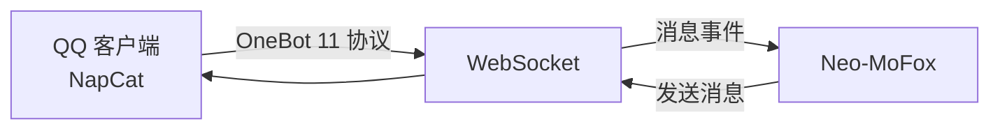
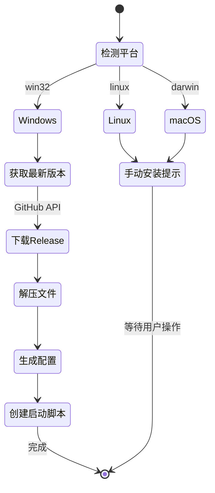
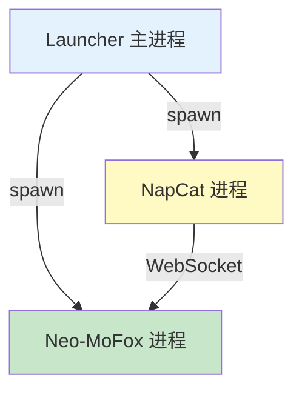

# NapCat 安装器设计

> **文档版本**: 1.0.0  
> **最后更新**: 2026-04-02  
> **维护者**: Neo-MoFox Launcher Team

## 📖 概述

本文档详细描述 NapCat 自动安装与配置系统的设计，包括下载流程、平台适配、配置自动化和进程集成策略。

**目标读者**: 核心开发者、平台适配维护者

**核心设计原则**:
- **自动化优先**: Windows 平台全自动安装配置
- **平台差异**: Linux/macOS 提供手动指引
- **版本管理**: 支持版本查询与更新
- **配置同步**: 自动配置反向 WebSocket 连接

---

## 🎯 NapCat 简介

###什么是 NapCat？

**NapCat** 是一个基于 NTQQ (QQ NT 架构) 的 OneBot 11 标准实现，提供 WebSocket/HTTP API 供机器人框架调用。

**官方仓库**: [NapNeko/NapCatQQ](https://github.com/NapNeko/NapCatQQ)

**为何需要 NapCat？**



- Neo-MoFox 本身不直接连接 QQ 服务器
- 需要通过 NapCat 作为协议适配器
- NapCat 提供稳定的 OneBot 11 API

---

## 🏗️ 安装流程设计

### 完整流程图



### 平台支持矩阵

| 平台 | 自动安装 | 自动配置 | 启动脚本 | 备注 |
|------|---------|---------|---------|-----|
| **Windows** | ✅ | ✅ | `.bat` | 完整支持 |
| **Linux** | ❌ | ✅ | `.sh` | 需手动安装 NapCat |
| **macOS** | ❌ | ✅ | `.sh` | 需手动安装 NapCat |

---

## 📥 下载流程（Windows）

### 1. 获取最新版本信息

**GitHub API 调用**:

```javascript
// VersionService.js
async fetchLatestNapCatRelease() {
  const MIRRORS = [
    'https://api.github.com',
    'https://api.ikun114.org',
    'https://api.kkgithub.com'
  ];
  
  for (const mirror of MIRRORS) {
    try {
      const url = `${mirror}/repos/NapNeko/NapCatQQ/releases/latest`;
      const response = await fetch(url, {
        headers: {
          'User-Agent': 'Neo-MoFox-Launcher',
          'Accept': 'application/vnd.github.v3+json'
        }
      });
      
      if (!response.ok) {
        throw new Error(`HTTP ${response.status}`);
      }
      
      const data = await response.json();
      return {
        version: data.tag_name,
        publishedAt: data.published_at,
        assets: data.assets.map(asset => ({
          name: asset.name,
          size: asset.size,
          downloadUrl: asset.browser_download_url
        }))
      };
    } catch (error) {
      logger.warn(`镜像 ${mirror} 请求失败:`, error.message);
    }
  }
  
  throw new Error('所有镜像请求失败');
}
```

**返回数据示例**:

```json
{
  "version": "v2.0.0",
  "publishedAt": "2024-01-15T10:30:00Z",
  "assets": [
    {
      "name": "NapCat.win32.x64.exe",
      "size": 102400000,
      "downloadUrl": "https://github.com/NapNeko/NapCatQQ/releases/download/v2.0.0/NapCat.win32.x64.exe"
    },
    {
      "name": "NapCat.linux.x64",
      "size": 98500000,
      "downloadUrl": "..."
    }
  ]
}
```

### 2. 资源名称匹配

**平台资源映射**:

```javascript
// PlatformHelper.js
const PLATFORM_CONFIG = {
  win32: {
    napcatAssetPattern: /NapCat\.win32\.x64\.exe/i,
    executableName: 'NapCat.win32.x64.exe'
  },
  linux: {
    napcatAssetPattern: /NapCat\.linux\.x64$/i,
    executableName: 'NapCat.linux.x64'
  },
  darwin: {
    napcatAssetPattern: /NapCat\.darwin\.(x64|arm64)$/i,
    executableName: 'NapCat.darwin.x64'
  }
};

function findPlatformAsset(assets) {
  const config = PLATFORM_CONFIG[process.platform];
  return assets.find(asset => config.napcatAssetPattern.test(asset.name));
}
```

### 3. 文件下载

**下载实现**:

```javascript
// InstallWizardService.js
async _downloadFile(url, destDir, onProgress) {
  const response = await fetch(url,  { redirect: 'follow' });
  
  if (!response.ok) {
    throw new Error(`下载失败: HTTP ${response.status}`);
  }
  
  const totalSize = parseInt(response.headers.get('content-length'), 10);
  let downloadedSize = 0;
  
  const filename = path.basename(new URL(response.url).pathname);
  const destPath = path.join(destDir, filename);
  
  await fs.mkdir(destDir, { recursive: true });
  const fileStream = fs.createWriteStream(destPath);
  
  // 读取响应流并写入文件
  for await (const chunk of response.body) {
    fileStream.write(chunk);
    downloadedSize += chunk.length;
    
    // 进度回调
    const progress = Math.round((downloadedSize / totalSize) * 100);
    onProgress?.(progress);
  }
  
  fileStream.end();
  
  // 设置可执行权限（Linux/macOS）
  if (process.platform !== 'win32') {
    await fs.chmod(destPath, 0o755);
  }
  
  return destPath;
}
```

**重定向处理**:

```javascript
// 支持 301/302 重定向（GitHub CDN）
const response = await fetch(url, {
  redirect: 'follow',  // 自动跟随重定向
  follow: 5            // 最多 5 次重定向
});
```

---

## ⚙️ 配置自动化

### 1. OneBot 11 配置

**配置文件路径**: `{napcatDir}/config/onebot11_{qqNumber}.json`

**配置模板**:

```json
{
  "http": {
    "enable": false,
    "host": "",
    "port": 0,
    "secret": "",
    "enableHeart": false,
    "enablePost": false,
    "postUrls": []
  },
  "ws": {
    "enable": false,
    "host": "",
    "port": 0
  },
  "reverseWs": {
    "enable": true,
    "urls": [
      "ws://localhost:3001"
    ]
  },
  "debug": false,
  "heartInterval": 30000,
  "messagePostFormat": "array",
  "enableLocalFile2Url": true,
  "musicSignUrl": "",
  "reportSelfMessage": false
},
  "token": ""
}
```

**生成逻辑**:

```javascript
async _generateNapCatConfig(qqNumber, wsPort) {
  return {
    http: { enable: false },
    ws: { enable: false },
    reverseWs: {
      enable: true,
      urls: [`ws://localhost:${wsPort}`]
    },
    debug: false,
    heartInterval: 30000,
    messagePostFormat: 'array',
    enableLocalFile2Url: true,
    reportSelfMessage: false,
    token: ''
  };
}

async _writeNapCatConfig(napcatDir, qqNumber, config) {
  const configPath = path.join(
    napcatDir,
    'config',
    `onebot11_${qqNumber}.json`
  );
  
  await fs.mkdir(path.dirname(configPath), { recursive: true });
  await fs.writeFile(
    configPath,
    JSON.stringify(config, null, 2),
    'utf8'
  );
  
  logger.info(`NapCat 配置已写入: ${configPath}`);
}
```

**关键字段说明**:

| 字段 | 值 | 说明 |
|-----|---|------|
| `reverseWs.enable` | `true` | 启用反向 WebSocket |
| `reverseWs.urls` | `["ws://localhost:3001"]` | Neo-MoFox 监听地址 |
| `http.enable` | `false` | 禁用 HTTP API（不需要） |
| `ws.enable` | `false` | 禁用正向 WebSocket |
| `messagePostFormat` | `"array"` | 消息格式为数组 |

### 2. 启动脚本生成

**Windows 批处理脚本**:

```batch
@echo off
chcp 65001 >nul
cd /d "%~dp0"

echo ========================================
echo   NapCat 启动器
echo   QQ 号: 123456789
echo ========================================
echo.

REM 检查文件是否存在
if not exist "NapCat.win32.x64.exe" (
    echo [错误] NapCat.win32.x64.exe 未找到！
    pause
    exit /b 1
)

REM 启动 NapCat
echo [信息] 正在启动 NapCat...
NapCat.win32.x64.exe -q 123456789

REM 异常退出处理
if errorlevel 1 (
    echo.
    echo [错误] NapCat 异常退出！
    pause
)
```

**Linux/macOS Shell 脚本**:

```bash
#!/bin/bash

QQ_NUMBER="123456789"
NAPCAT_EXEC="./NapCat.linux.x64"

echo "========================================"
echo "  NapCat 启动器"
echo "  QQ 号: $QQ_NUMBER"
echo "========================================"
echo

# 检查文件
if [ ! -f "$NAPCAT_EXEC" ]; then
    echo "[错误] $NAPCAT_EXEC 未找到！"
    exit 1
fi

# 设置可执行权限
chmod +x "$NAPCAT_EXEC"

# 启动 NapCat
echo "[信息] 正在启动 NapCat..."
"$NAPCAT_EXEC" -q "$QQ_NUMBER"

# 异常退出处理
if [ $? -ne 0 ]; then
    echo
    echo "[错误] NapCat 异常退出！"
    read -p "按回车键退出..."
fi
```

**生成代码**:

```javascript
async _generateStartScript(napcatDir, qqNumber, platform) {
  const scripts = {
    win32: `@echo off
chcp 65001 >nul
cd /d "%~dp0"
NapCat.win32.x64.exe -q ${qqNumber}
pause`,
    
    linux: `#!/bin/bash
cd "$(dirname "$0")"
./NapCat.linux.x64 -q ${qqNumber}`,
    
    darwin: `#!/bin/bash
cd "$(dirname "$0")"
./NapCat.darwin.x64 -q ${qqNumber}`
  };
  
  const scriptContent = scripts[platform];
  const scriptName = platform === 'win32' ? 'napcat.bat' : 'napcat.sh';
  const scriptPath = path.join(napcatDir, scriptName);
  
  await fs.writeFile(scriptPath, scriptContent, 'utf8');
  
  // Linux/macOS 设置可执行权限
  if (platform !== 'win32') {
    await fs.chmod(scriptPath, 0o755);
  }
  
  logger.info(`启动脚本已生成: ${scriptPath}`);
}
```

---

## 🔄 版本管理

### 更新检测

```javascript
//VersionService.js
async checkNapCatUpdate(instanceId) {
  const instance = await storageService.getInstanceById(instanceId);
  const currentVersion = instance.napcatVersion;  // 如 "v1.9.0"
  
  const latestRelease = await this.fetchLatestNapCatRelease();
  const latestVersion = latestRelease.version;    // 如 "v2.0.0"
  
  if (this._compareVersions(latestVersion, currentVersion) > 0) {
    return {
      hasUpdate: true,
      currentVersion,
      latestVersion,
      releaseUrl: `https://github.com/NapNeko/NapCatQQ/releases/${latestVersion}`
    };
  }
  
  return { hasUpdate: false, currentVersion };
}

_compareVersions(v1, v2) {
  const parse = (v) => v.replace(/^v/, '').split('.').map(Number);
  const [a1, a2, a3] = parse(v1);
  const [b1, b2, b3] = parse(v2);
  
  if (a1 !== b1) return a1 - b1;
  if (a2 !== b2) return a2 - b2;
  return a3 - b3;
}
```

### 更新流程

```javascript
async updateNapCat(instanceId) {
  const instance = await storageService.getInstanceById(instanceId);
  const { napcatDir } = instance;
  
  // 1. 备份当前版本
  const backupDir = `${napcatDir}.backup`;
  await fs.cp(napcatDir, backupDir, { recursive: true });
  
  try {
    // 2. 下载最新版本
    const releaseInfo = await this.fetchLatestNapCatRelease();
    const asset = findPlatformAsset(releaseInfo.assets);
    
    await this._downloadFile(asset.downloadUrl, napcatDir, (progress) => {
      this._emitProgress(instanceId, 'download', progress, '下载中...');
    });
    
    // 3. 更新版本号
    await storageService.updateInstance(instanceId, {
      napcatVersion: releaseInfo.version
    });
    
    // 4. 删除备份
    await fs.rm(backupDir, { recursive: true });
    
    logger.info(`NapCat 更新完成: ${releaseInfo.version}`);
  } catch (error) {
    // 恢复备份
    await fs.rm(napcatDir, { recursive: true });
    await fs.rename(backupDir, napcatDir);
    throw error;
  }
}
```

---

## 🖥️ 进程集成

### 分离式启动

**设计原理**: NapCat 和 Neo-MoFox 作为独立进程运行，互不依赖



### 启动顺序

```javascript
// main.js - 实例详情页启动
async function startInstance(instanceId) {
  const instance = await storageService.getInstanceById(instanceId);
  
  // 1. 先启动 NapCat
  await startNapCatProcess(instance);
  
  // 2. 等待 2 秒（让 NapCat 初始化）
  await new Promise(resolve => setTimeout(resolve, 2000));
  
  // 3. 启动 Neo-MoFox
  await startMoFoxProcess(instance);
  
  // 4. 可选：打开 NapCat WebUI
  if (globalSettings.autoOpenNapcatWebUI) {
    await shell.openExternal('http://localhost:6099');
  }
}
```

### 进程管理

```javascript
// 存储进程句柄
const instanceProcesses = new Map();

function startNapCatProcess(instance) {
  const { napcatDir, qqNumber } = instance;
  const exePath = path.join(napcatDir, 'NapCat.win32.x64.exe');
  
  const proc = spawn(exePath, ['-q', qqNumber], {
    cwd: napcatDir,
    stdio: ['pipe', 'pipe', 'pipe']
  });
  
  // 日志捕获
  proc.stdout.on('data', (data) => {
    const logs = data.toString().split('\n');
    mainWindow.webContents.send('instance-log', {
      instanceId: instance.id,
      type: 'napcat',
      logs
    });
  });
  
  // 崩溃重启
  proc.on('close', (code) => {
    if (code !== 0) {
      logger.error(`NapCat 异常退出，代码: ${code}`);
      setTimeout(() => startNapCatProcess(instance), 3000);
    }
  });
  
  // 保存句柄
  instanceProcesses.set(`${instance.id}_napcat`, proc);
}
```

**详细设计**: 参见 [05-process-manager.md](./05-process-manager.md)

---

## 🐧 Linux/macOS 手动安装指引

### 安装提示 UI

```javascript
// wizard.js - Linux 平台检测
if (platform === 'linux' || platform === 'darwin') {
  showManualInstallGuide(platform);
}

function showManualInstallGuide(platform) {
  const guide = platform === 'linux' 
    ? `请手动安装 NapCat：

1. 访问 https://github.com/NapNeko/NapCatQQ/releases
2. 下载 NapCat.linux.x64
3. 将文件移动到: ${napcatDir}
4. 执行: chmod +x NapCat.linux.x64

完成后，启动器将自动配置连接参数。`
    : `请手动安装 NapCat：

1. 访问 https://github.com/NapNeko/NapCatQQ/releases
2. 根据芯片选择下载：
   - Intel: NapCat.darwin.x64
   - Apple Silicon: NapCat.darwin.arm64
3. 将文件移动到: ${napcatDir}
4. 执行: chmod +x NapCat.darwin.*

完成后，启动器将自动配置连接参数。`;
  
  showInfoDialog('手动安装 NapCat', guide);
}
```

### 验证安装

```javascript
async function verifyNapCatInstalled(napcatDir) {
  const executableName = platformHelper.getNapCatExecutableName();
  const execPath = path.join(napcatDir, executableName);
  
  try {
    await fs.access(execPath, fs.constants.X_OK);
    return true;
  } catch {
    return false;
  }
}
```

---

## 🔗 相关文档

### 设计文档
- [01-architecture.md](./01-architecture.md) - 架构设计
- [02-install-wizard.md](./02-install-wizard.md) - 安装向导（NapCat 集成步骤）
- [05-process-manager.md](./05-process-manager.md) - 进程管理（启动控制）
- [06-update-channel.md](./06-update-channel.md) - 版本管理（NapCat 更新）

### 代码文件
- [src/services/install/InstallWizardService.js](../src/services/install/InstallWizardService.js) - NapCat 安装实现
- [src/services/version/VersionService.js](../src/services/version/VersionService.js) - 版本检测与更新
- [src/services/PlatformHelper.js](../src/services/PlatformHelper.js) - 平台资源映射

---

## 📚 参考资源

- [NapCatQQ 官方仓库](https://github.com/NapNeko/NapCatQQ)
- [OneBot 11 标准](https://github.com/botuniverse/onebot-11)
- [GitHub Releases API](https://docs.github.com/en/rest/releases)

---

## 📝 更新日志

| 版本 | 日期 | 变更内容 |
|------|------|---------|
| 1.0.0 | 2026-04-02 | 初版发布，完整 NapCat 安装器设计 |

---

*如有问题或建议，请在 [GitHub Issues](https://github.com/MoFox-Studio/Neo-MoFox-Launcher/issues) 提出*
