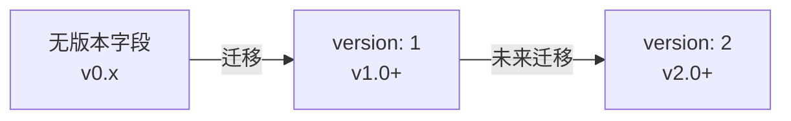

# 数据持久化设计

> **文档版本**: 1.0.0  
> **最后更新**: 2026-04-02  
> **维护者**: Neo-MoFox Launcher Team

## 📖 概述

本文档详细描述 Neo-MoFox Launcher 的数据持久化方案，包括存储架构、数据模型、文件格式、原子写入机制和版本迁移策略。

**目标读者**: 后端开发者、数据架构师

**核心设计原则**:
- **数据安全**: 原子写入防止数据损坏
- **版本演进**: 支持数据模型迁移
- **可读性**: 使用人类可读的格式（JSON/TOML）
- **备份友好**: 单文件设计，便于备份与恢复

---

## 🏗️ 存储架构

### 1. 存储层次结构

```
应用数据根目录
├── instances.json          # 实例列表（核心数据）
├── settings.json           # 全局设置
├── logs/                   # 启动器日志
│   ├── launcher_2026-04-02.log
│   ├── launcher_2026-04-01.log.gz
│   └── ...
└── instance_logs/          # 实例日志
    ├── instance_1234567890000_mofox.log
    ├── instance_1234567890000_napcat.log
    └── ...

实例安装目录
└── [defaultInstallDir]/
    ├── instance_1234567890000/
    │   ├── neo-mofox/           # MoFox 仓库
    │   │   ├── .venv/           # 虚拟环境
    │   │   ├── config/
    │   │   │   ├── core.toml    # MoFox 核心配置
    │   │   │   └── model.toml   # LLM 模型配置
    │   │   └── ...
    │   └── napcat/              # NapCat 安装目录
    │       ├── NapCat.win32.x64.exe
    │       └── config/
    │           └── onebot11_*.json
    └── instance_9876543210000/
        └── ...
```

### 2. 存储路径策略

**应用数据目录优先级**:

```javascript
// StorageService.js - 存储路径决策逻辑
const DATA_DIR_PRIORITY = [
  process.env.NEO_MOFOX_LAUNCHER_DATA,  // 1. 环境变量
  CLI_FLAGS['--data-dir'],               // 2. 命令行参数
  app.getPath('appData') + '/Neo-MoFox-Launcher'  // 3. 默认路径
];

// 实例安装目录
// 优先使用全局设置中的 defaultInstallDir
// 默认: 'D:\\Neo-MoFox_Bots'（Windows）
```

**跨平台默认路径**:

| 平台 | 应用数据目录 | 默认安装目录 |
|-----|------------|------------|
| Windows | `%APPDATA%\Neo-MoFox-Launcher\` | `D:\Neo-MoFox_Bots\` |
| Linux | `~/.config/Neo-MoFox-Launcher/` | `~/Neo-MoFox_Bots/` |
| macOS | `~/Library/Application Support/Neo-MoFox-Launcher/` | `~/Neo-MoFox_Bots/` |

---

## 📊 数据模型

### 1. instances.json - 实例列表

**数据结构**:

```json
{
  "version": 1,
  "instances": [
    {
      "id": "instance_1704067200000",
      "displayName": "我的测试机器人",
      "qqNumber": "123456789",
      "neomofoxDir": "D:\\Neo-MoFox_Bots\\instance_1704067200000\\neo-mofox",
      "napcatDir": "D:\\Neo-MoFox_Bots\\instance_1704067200000\\napcat",
      "napcatVersion": "2.0.0",
      "installCompleted": true,
      "installSteps": [
        "clone",
        "venv",
        "deps",
        "gen-config",
        "write-core",
        "write-model",
        "write-adapter",
        "napcat",
        "napcat-config",
        "register"
      ],
      "channel": "main",
      "description": "用于测试新功能的机器人实例",
      "createdAt": "2024-01-01T00:00:00.000Z",
      "updatedAt": "2024-01-15T08:30:00.000Z"
    }
  ]
}
```

**字段说明**:

| 字段 | 类型 | 必填 | 说明 |
|-----|------|-----|------|
| `version` | Number | ✅ | 数据模型版本号（当前为 1） |
| `instances` | Array | ✅ | 实例列表 |
| ↳ `id` | String | ✅ | 实例唯一标识符（格式: `instance_{timestamp}`） |
| ↳ `displayName` | String | ✅ | 用户定义的实例名称 |
| ↳ `qqNumber` | String | ✅ | QQ 号码 |
| ↳ `neomofoxDir` | String | ✅ | MoFox 安装路径（绝对路径） |
| ↳ `napcatDir` | String | ✅ | NapCat 安装路径（绝对路径） |
| ↳ `napcatVersion` | String | ❌ | NapCat 版本号 |
| ↳ `installCompleted` | Boolean | ✅ | 安装是否完成 |
| ↳ `installSteps` | Array | ✅ | 已完成的安装步骤列表 |
| ↳ `channel` | String | ✅ | Git 分支（`main` / `dev`） |
| ↳ `description` | String | ❌ | 实例描述（用户备注） |
| ↳ `createdAt` | String | ❌ | 创建时间（ISO 8601） |
| ↳ `updatedAt` | String | ❌ | 最后更新时间（ISO 8601） |

**ID 生成策略**:

```javascript
// 使用时间戳保证唯一性
const generateInstanceId = () => {
  return `instance_${Date.now()}`;
};

// 示例: instance_1704067200000
```

**为何使用时间戳而非 UUID？**
- ✅ 更短（便于日志查看）
- ✅ 自然排序（按创建时间）
- ✅ 可读性更好
- ⚠️ 需确保系统时间正确

---

### 2. settings.json - 全局设置

**数据结构**:

```json
{
  "version": 1,
  "defaultInstallDir": "D:\\Neo-MoFox_Bots",
  "language": "zh-CN",
  "theme": "dark",
  "autoOpenNapcatWebUI": true,
  "oobeCompleted": true,
  "configEditor": {
    "useBuiltIn": true,
    "externalCommand": "code {file}"
  },
  "logging": {
    "level": "info",
    "maxArchiveDays": 30,
    "compressArchive": true,
    "rotationMode": "DATE"
  },
  "update": {
    "autoCheck": true,
    "channel": "stable"
  },
  "advanced": {
    "enableBetaFeatures": false,
    "showDebugInfo": false
  }
}
```

**字段说明**:

| 字段路径 | 类型 | 默认值 | 说明 |
|---------|------|--------|------|
| `version` | Number | `1` | 配置版本号 |
| `defaultInstallDir` | String | `D:\Neo-MoFox_Bots` | 默认安装路径 |
| `language` | String | `zh-CN` | 界面语言（保留字段） |
| `theme` | String | `dark` | 主题（`dark`/`light`/`system`） |
| `autoOpenNapcatWebUI` | Boolean | `true` | 启动 NapCat 时自动打开 WebUI |
| `oobeCompleted` | Boolean | `false` | 首次运行体验是否完成 |
| `configEditor.useBuiltIn` | Boolean | `true` | 使用内置编辑器 |
| `configEditor.externalCommand` | String | `code {file}` | 外部编辑器命令模板 |
| `logging.maxArchiveDays` | Number | `30` | 日志归档保留天数 |
| `logging.compressArchive` | Boolean | `true` | 是否压缩归档日志 |
| `logging.rotationMode` | String | `DATE` | 轮转模式（`DATE`/`SIZE`/`BOTH`） |

**部分更新支持**:

```javascript
// SettingsService.js
async set(patch) {
  const current = await this.get();
  const updated = { ...current, ...patch };  // 浅合并
  await this._write(updated);
  return updated;
}

// 使用示例
await settingsService.set({ theme: 'light' });  // 仅更新主题
```

---

### 3. TOML 配置文件

#### 3.1 core.toml - MoFox 核心配置

**生成路径**: `{neomofoxDir}/config/core.toml`

**关键字段**:

```toml
[bot]
platform = "qq"
qq_number = "123456789"

[database]
database_type = "sqlite"

[general]
master_users = [123456789]

[adapter.adapter_config]
websocket_url = "ws://localhost:3001"
reverse_websocket = { enabled = true, port = 3001 }

[webui]
enabled = true
webui_api_key = "launch_webui_token_xxx"
```

**写入逻辑**:

```javascript
// InstallWizardService.js - 生成配置对象
const coreConfig = {
  bot: { platform: 'qq', qq_number: qqNumber },
  database: { database_type: 'sqlite' },
  general: { master_users: [parseInt(qqNumber)] },
  adapter: {
    adapter_config: {
      websocket_url: `ws://localhost:${wsPort}`,
      reverse_websocket: { enabled: true, port: wsPort }
    }
  },
  webui: {
    enabled: true,
    webui_api_key: webuiToken
  }
};

// 使用 @iarna/toml 序列化
const tomlString = TOML.stringify(coreConfig);
await fs.writeFile(coreTomlPath, tomlString, 'utf8');
```

#### 3.2 model.toml - LLM 模型配置

**关键字段**:

```toml
[model_sets.default]
model = "gpt-4o-mini"
api_key = "sk-xxx"
base_url = "https://api.openai.com/v1"
```

**安全性考虑**:
- ⚠️ API Key 明文存储（未加密）
- **改进方向**: 使用 Electron `safeStorage` API 加密

---

## 🔒 原子写入机制

### 核心原理

**为何需要原子写入？**

普通写入流程：
```
1. 打开文件句柄
2. 写入新内容
3. 关闭文件
```

**风险**:
- 写入过程中断电 → 文件损坏
- 写入过程中应用崩溃 → 数据不完整

**原子写入流程**:
```
1. 写入到临时文件（.tmp 后缀）
2. 写入完成后，重命名临时文件覆盖原文件
3. 操作系统保证重命名是原子操作
```

### 实现代码

```javascript
// StorageService.js - 原子写入实现
async _atomicWrite(filePath, data) {
  const tmpPath = `${filePath}.tmp`;
  
  try {
    // 1. 写入临时文件
    const jsonString = JSON.stringify(data, null, 2);
    await fs.writeFile(tmpPath, jsonString, 'utf8');
    
    // 2. 原子重命名（覆盖原文件）
    await fs.rename(tmpPath, filePath);
    
    logger.debug(`原子写入成功: ${filePath}`);
  } catch (error) {
    // 3. 失败时清理临时文件
    try {
      await fs.unlink(tmpPath);
    } catch {}
    throw error;
  }
}
```

### 优势与局限

**优势**:
- ✅ 防止数据损坏（要么完全成功，要么完全失败）
- ✅ 跨平台支持（fs.rename 在所有平台都是原子的）
- ✅ 实现简单

**局限**:
- ⚠️ 仅保护单文件操作（不支持事务）
- ⚠️ 临时文件占用额外磁盘空间（短暂）

---

## 🔄 版本迁移机制

### 迁移策略

**设计原则**:
- 向后兼容：新版本能读取旧版本数据
- 自动迁移：首次读取时自动升级
- 备份保护：迁移前备份原文件

**版本演进路径**:



### 实现示例

```javascript
// StorageService.js - 版本迁移
async _migrateData(data) {
  const currentVersion = data.version || 0;
  
  if (currentVersion === 0) {
    logger.info('检测到旧版本数据，开始迁移到 v1...');
    
    // 备份原数据
    const backupPath = `${this.instancesPath}.v0.backup`;
    await fs.copyFile(this.instancesPath, backupPath);
    
    // 执行迁移
    const migratedData = {
      version: 1,
      instances: data.instances.map(instance => ({
        ...instance,
        channel: instance.channel || 'main',  // 补充缺失字段
        createdAt: instance.createdAt || new Date().toISOString(),
        updatedAt: instance.updatedAt || new Date().toISOString()
      }))
    };
    
    // 保存迁移后的数据
    await this._atomicWrite(this.instancesPath, migratedData);
    
    logger.info('数据迁移完成，备份已保存至:', backupPath);
    return migratedData;
  }
  
  return data;  // 无需迁移
}

// 在读取时自动调用
async getAllInstances() {
  const rawData = await this._read(this.instancesPath);
  const migratedData = await this._migrateData(rawData);
  return migratedData.instances;
}
```

### 迁移检查清单

**v0 → v1 迁移**:
- [ ] 添加 `version` 字段
- [ ] 为所有实例添加 `channel` 字段（默认 `main`）
- [ ] 添加 `createdAt` / `updatedAt` 时间戳
- [ ] 创建备份文件 `.v0.backup`

**未来 v1 → v2 迁移规划**:
- 可能的变更：实例分组、标签系统、多 QQ 号支持

---

## 📁 文件操作 API

### StorageService 核心方法

```javascript
class StorageService {
  // === 实例管理 ===
  
  /**
   * 获取所有实例
   * @returns {Promise<Array>} 实例列表
   */
  async getAllInstances() { /*...*/ }
  
  /**
   * 根据 ID 获取实例
   * @param {string} instanceId - 实例 ID
   * @returns {Promise<Object|null>} 实例对象或 null
   */
  async getInstanceById(instanceId) { /*...*/ }
  
  /**
   * 添加新实例
   * @param {Object} instanceData - 实例数据
   * @returns {Promise<Object>} 添加后的完整实例对象
   */
  async addInstance(instanceData) { /*...*/ }
  
  /**
   * 更新实例
   * @param {string} instanceId - 实例 ID
   * @param {Object} updates - 要更新的字段
   * @returns {Promise<Object>} 更新后的实例对象
   */
  async updateInstance(instanceId, updates) { /*...*/ }
  
  /**
   * 删除实例
   * @param {string} instanceId - 实例 ID
   * @returns {Promise<boolean>} 是否成功删除
   */
  async deleteInstance(instanceId) { /*...*/ }
  
  // === TOML 配置文件操作 ===
  
  /**
   * 读取 TOML 文件
   * @param {string} filePath - TOML 文件路径
   * @returns {Promise<Object>} 解析后的对象
   */
  async readTOML(filePath) {
    const content = await fs.readFile(filePath, 'utf8');
    return TOML.parse(content);
  }
  
  /**
   * 写入 TOML 文件
   * @param {string} filePath - TOML 文件路径
   * @param {Object} data - 要写入的数据对象
   */
  async writeTOML(filePath, data) {
    const tomlString = TOML.stringify(data);
    await this._atomicWrite(filePath, tomlString);
  }
  
  /**
   * 验证 TOML 语法
   * @param {string} content - TOML 字符串
   * @returns {Object} { valid: boolean, error?: string, line?: number }
   */
  validateTOML(content) {
    try {
      TOML.parse(content);
      return { valid: true };
    } catch (error) {
      return {
        valid: false,
        error: error.message,
        line: error.line,
        column: error.column
      };
    }
  }
}
```

### 使用示例

```javascript
// 在主进程中使用
const storageService = new StorageService();

// 添加实例
const newInstance = await storageService.addInstance({
  displayName: '测试机器人',
  qqNumber: '987654321',
  neomofoxDir: 'D:\\Bots\\instance_xxx\\neo-mofox',
  napcatDir: 'D:\\Bots\\instance_xxx\\napcat',
  channel: 'main'
});

// 更新实例
await storageService.updateInstance(newInstance.id, {
  description: '更新后的描述',
  napcatVersion: '2.1.0'
});

// 读取 TOML 配置
const coreConfig = await storageService.readTOML(
  path.join(newInstance.neomofoxDir, 'config', 'core.toml')
);

// 修改并写回
coreConfig.webui.enabled = false;
await storageService.writeTOML(coreTomlPath, coreConfig);
```

---

## 🛡️ 数据安全性

### 当前安全措施

1. **原子写入** - 防止数据损坏
2. **版本迁移** - 自动创建备份
3. **文件权限** - 依赖操作系统默认权限

### 安全隐患

| 风险 | 严重度 | 影响 | 缓解措施 |
|------|--------|------|---------|
| **API Key 明文存储** | 🔴 高 | 敏感信息泄露 | 使用 Electron `safeStorage` 加密 |
| **无备份恢复功能** | 🟡 中 | 误删除实例后无法恢复 | 实现定期备份 + 软删除机制 |
| **并发写入冲突** | 🟢 低 | 多进程写入可能冲突 | 当前单实例运行，暂无风险 |
| **日志文件过大** | 🟢 低 | 磁盘空间占用 | LoggerService 已实现轮转 |

### 改进建议

#### 1. 敏感信息加密

```javascript
// 使用 Electron safeStorage API
const { safeStorage } = require('electron');

// 加密 API Key
function encryptApiKey(apiKey) {
  if (safeStorage.isEncryptionAvailable()) {
    const encrypted = safeStorage.encryptString(apiKey);
    return encrypted.toString('base64');
  }
  return apiKey;  // Fallback
}

// 解密 API Key
function decryptApiKey(encryptedKey) {
  if (safeStorage.isEncryptionAvailable()) {
    const buffer = Buffer.from(encryptedKey, 'base64');
    return safeStorage.decryptString(buffer);
  }
  return encryptedKey;  // Fallback
}
```

#### 2. 备份与恢复

```javascript
// 定期备份（每天 1 次）
async function createBackup() {
  const timestamp = new Date().toISOString().replace(/[:.]/g, '-');
  const backupPath = path.join(
    app.getPath('appData'),
    'Neo-MoFox-Launcher',
    'backups',
    `instances_${timestamp}.json`
  );
  
  await fs.copyFile(instancesPath, backupPath);
  
  // 清理 30 天前的备份
  await cleanOldBackups(30);
}

// 软删除机制
async function softDeleteInstance(instanceId) {
  await storageService.updateInstance(instanceId, {
    deleted: true,
    deletedAt: new Date().toISOString()
  });
  // 30 天后彻底删除
}
```

---

## 📊 性能考量

### 当前性能特征

**数据量级**:
- 典型场景：< 10 个实例
- 极端场景：< 100 个实例

**操作复杂度**:

| 操作 | 时间复杂度 | 说明 |
|------|----------|------|
| 读取所有实例 | O(1) | 全量加载到内存 |
| 查询单个实例 | O(n) | 线性搜索（n < 100） |
| 添加实例 | O(n) | 读取 + 追加 + 写入 |
| 更新实例 | O(n) | 读取 + 修改 + 写入 |
| 删除实例 | O(n) | 读取 + 过滤 + 写入 |

**磁盘 I/O**:
- 每次操作都触发完整文件读写
- 原子写入额外创建临时文件

### 性能优化方向

**场景 1: 实例数量 > 100**
- **问题**: 线性搜索效率低
- **方案**: 迁移到 SQLite，索引 `id` 字段

**场景 2: 频繁更新**
- **问题**: 每次更新都全量写入
- **方案**: 
  - 引入内存缓存 + 定时刷盘
  - 使用 SQLite 事务批量提交

**场景 3: 启动时间优化**
- **问题**: 需要读取完整配置
- **方案**: 
  - 延迟加载实例详情
  - 仅加载必要字段（displayName/id/status）

---

## 🔗 相关文档

### 设计文档
- [01-architecture.md](./01-architecture.md) - 架构设计（服务层概览）
- [04-instance-manager.md](./04-instance-manager.md) - 实例管理器（数据模型应用）
- [05-process-manager.md](./05-process-manager.md) - 进程管理器（日志存储）

### 代码文件
- [src/services/install/StorageService.js](../src/services/install/StorageService.js) - 存储服务实现
- [src/services/settings/SettingsService.js](../src/services/settings/SettingsService.js) - 设置服务
- [src/services/LoggerService.js](../src/services/LoggerService.js) - 日志服务

---

## 📚 参考资源

- [Node.js fs Promises API](https://nodejs.org/api/fs.html#promises-api)
- [@iarna/toml 文档](https://www.npmjs.com/package/@iarna/toml)
- [Electron safeStorage API](https://www.electronjs.org/docs/latest/api/safe-storage)
- [原子文件操作最佳实践](https://rcoh.me/posts/atomic-file-updates/)

---

## 📝 更新日志

| 版本 | 日期 | 变更内容 |
|------|------|---------|
| 1.0.0 | 2026-04-02 | 初版发布，完整数据持久化设计 |

---

*如有问题或建议，请在 [GitHub Issues](https://github.com/MoFox-Studio/Neo-MoFox-Launcher/issues) 提出*
